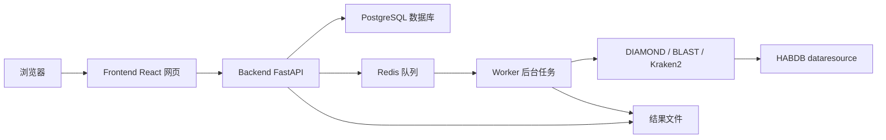

# HABDB-Web-v2 运行指南（小白版）

**生成时间：** 2026-06-11 15:29:52  
**网站目录：** `I:\论文\赤潮\文章\数据库文章\openclaw\codex\NAR\WebSite\HABDB-Web-v2`  
**适用对象：** 第一次运行 Docker / FastAPI / React / PostgreSQL 项目的用户  

---

## 1. 先理解：这个网站到底由什么组成？

`HABDB-Web-v2` 不是一个双击 HTML 就能完整运行的网站。它是一个更接近正式数据库网站的工程，里面有多个服务一起工作：

| 服务 | 作用 | 类比 |
|---|---|---|
| Frontend 前端 | 浏览器里看到的网页界面 | 网站门面 |
| Backend 后端 FastAPI | 提供数据接口、提交检索任务、下载文件 | 服务窗口 |
| PostgreSQL 数据库 | 保存 species、18SrRNA、genome、functional gene、download 等表 | 数据仓库 |
| Redis | 保存任务队列状态 | 排队叫号系统 |
| Worker | 后台执行 DIAMOND / BLAST / Kraken2 检索 | 后台实验员 |
| dataresource | 原始 HABDB 数据文件，不复制到 v2 | 原始材料库 |

它们之间的大致关系是：



所以运行 v2 的核心思想是：

1. 先启动数据库和队列；
2. 把原始资源导入 PostgreSQL；
3. 启动后端、worker、前端；
4. 用浏览器访问前端；
5. 前端通过 API 读取数据库和提交检索任务。

---

## 2. 你需要先安装什么？

### 2.1 必须安装 Docker Desktop

v2 推荐使用 Docker Compose 运行。你需要先安装：

- Docker Desktop for Windows

安装后打开 Docker Desktop，确认左下角或主界面显示 Docker 正在运行。

### 2.2 可选安装 Git Bash / Make

项目里提供了 `Makefile`，里面有这些命令：

```powershell
make bootstrap
make import-data
make reset-db
make build-indexes
make verify-release
```

但是 Windows 默认不一定有 `make`。如果你没有 `make`，不用慌，可以直接用后面给你的 Docker 命令替代。

---

## 3. 文件夹说明

你的 v2 网站目录是：

```text
I:\论文\赤潮\文章\数据库文章\openclaw\codex\NAR\WebSite\HABDB-Web-v2
```

原始资源目录仍然在 v1：

```text
I:\论文\赤潮\文章\数据库文章\openclaw\codex\NAR\WebSite\HABDB-Web\dataresource
```

v2 不复制这 33GB 数据，而是在 Docker 里把它“挂载”为只读目录：

```text
/dataresource
```

这样做的好处是：

- 不浪费硬盘；
- 不破坏原始数据；
- v1 可以作为备份；
- v2 可以读取同一批资源。

---

## 4. 第一次运行：推荐步骤

### 第 1 步：打开 PowerShell

按 `Win + S`，搜索 `PowerShell`，打开。

### 第 2 步：进入 v2 网站目录

复制下面命令并回车：

```powershell
cd "I:\论文\赤潮\文章\数据库文章\openclaw\codex\NAR\WebSite\HABDB-Web-v2"
```

### 第 3 步：创建 `.env` 配置文件

第一次运行需要从模板复制一份配置：

```powershell
copy .env.example .env
```

`.env` 可以理解为“网站运行配置表”，里面写了数据库地址、Redis 地址、DIAMOND 数据库路径、18SrRNA 索引路径等。

### 第 4 步：启动数据库和 Redis

```powershell
docker compose up -d db redis
```

这一步会启动：

- PostgreSQL 数据库；
- Redis 队列。

第一次运行 Docker 可能会下载镜像，时间会比较久，这是正常的。

### 第 5 步：构建后端和 worker 镜像

```powershell
docker compose build backend worker
```

这一步会安装 Python 依赖，并在容器中安装：

- DIAMOND；
- BLAST+；
- Kraken2。

如果你的网络访问 Docker Hub 或 apt 源较慢，这一步可能需要较长时间。

### 第 6 步：导入 HABDB 数据

```powershell
docker compose run --rm backend python scripts/import_data.py --source /dataresource --reset
```

这一步非常关键。

它会做这些事：

- 创建 PostgreSQL 表；
- 读取 `HABDB-List.xlsx`；
- 读取 18SrRNA metadata；
- 读取 genome metadata；
- 读取 functional gene seed sequence；
- 读取 download file 信息；
- 写入 species、marker_sequence、genome、gene_family、functional_sequence、download_file 等表；
- 生成 statistics cache；
- 生成 release manifest；
- 计算小文件 checksum；
- 避免重复导入。

看到 `Import completed.` 类似输出，说明导入完成。

### 第 7 步：启动所有服务

```powershell
docker compose up -d backend worker frontend
```

这一步会启动：

- 后端 API；
- 后台检索 worker；
- 前端网页。

### 第 8 步：打开网站

浏览器打开：

```text
http://localhost:5173
```

后端 API 地址是：

```text
http://localhost:8000
```

API 文档地址是：

```text
http://localhost:8000/docs
```

---

## 5. 如果你有 make，可以一键运行

如果你的电脑能运行 `make`，可以用更简单的命令：

```powershell
cd "I:\论文\赤潮\文章\数据库文章\openclaw\codex\NAR\WebSite\HABDB-Web-v2"
copy .env.example .env
make bootstrap
```

`make bootstrap` 内部会做：

1. 启动 db 和 redis；
2. 构建 backend 和 worker；
3. 导入数据；
4. 启动 backend、worker、frontend。

---

## 6. 每次日常运行怎么做？

如果你已经完成过首次导入，以后一般不需要重新导入数据。

日常启动：

```powershell
cd "I:\论文\赤潮\文章\数据库文章\openclaw\codex\NAR\WebSite\HABDB-Web-v2"
docker compose up -d
```

日常关闭：

```powershell
docker compose down
```

查看运行状态：

```powershell
docker compose ps
```

查看日志：

```powershell
docker compose logs -f --tail=200
```

---

## 7. 什么时候需要重新导入数据？

只有这些情况需要重新导入：

- 你修改了 `dataresource` 中的 Excel / FASTA / id2genemap 等文件；
- 你改了数据库表结构；
- 你想清空旧数据重新构建；
- 导入过程出错，需要重来。

重新导入命令：

```powershell
docker compose run --rm backend python scripts/import_data.py --source /dataresource --reset
```

如果有 `make`：

```powershell
make reset-db
```

---

## 8. 如何验证网站是否正常？

### 8.1 看 Docker 服务是否都在运行

```powershell
docker compose ps
```

正常应该看到这些服务：

- db
- redis
- backend
- worker
- frontend

### 8.2 检查后端健康状态

浏览器打开：

```text
http://localhost:8000/api/health
```

如果看到类似：

```json
{"status": "ok", "release": "HABDB v2.0-dev"}
```

说明后端正常。

### 8.3 检查统计接口

浏览器打开：

```text
http://localhost:8000/api/summary
```

如果能看到 species、18SrRNA marker、gene family 等统计，说明数据库导入成功。

### 8.4 打开前端页面

浏览器打开：

```text
http://localhost:5173
```

如果能看到 HABDB v2 首页、Species、Functional Genes、Tools、Downloads，说明前端正常。

---

## 9. 序列检索怎么理解？

v2 设计了真实任务流程：

```text
前端提交 FASTA
  -> 后端创建 job
  -> Redis 排队
  -> Worker 执行工具
  -> 读取 HABDB 数据库或索引
  -> 输出结果 TSV
  -> 前端展示结果
  -> 支持下载结果
```

### 9.1 DIAMOND

DIAMOND 是当前优先真实接入的检索方式。

它使用：

```text
/dataresource/HABs_Func_db.dmnd
```

也就是原始资源里的：

```text
HABs_Func_db.dmnd
```

如果这个文件存在，并且 Docker 镜像里 DIAMOND 安装成功，DIAMOND job 就可以真实运行。

### 9.2 BLASTN 18SrRNA

BLASTN 18SrRNA 需要先有 BLAST index。

原始 FASTA 是：

```text
/dataresource/HABDB-AS/HABDB-AS-18SrRNA/HABs_18S_sequences.fasta
```

注意：文件名里历史上叫 `18S`，但网站显示统一叫 `18SrRNA`。

构建索引：

```powershell
docker compose run --rm worker python scripts/build_indexes.py --source /dataresource
```

或：

```powershell
make build-indexes
```

### 9.3 Kraken2 18SrRNA

Kraken2 需要解压好的数据库目录。

当前原始资源里有：

```text
HABs_Final_Kraken2_db.tar.gz
```

v2 已经准备好 Kraken2 job workflow，但需要你后续把 Kraken2 数据库解压到：

```text
HABDB-Web-v2/indexes/kraken2_18SrRNA
```

如果没有解压，Kraken2 job 不会用假结果，而是返回：

```text
waiting_for_index
```

并提示缺哪个路径。

---

## 10. 常见问题

### 问题 1：`docker` 命令不存在

说明 Docker Desktop 没装好，或者没有启动。

解决：

1. 安装 Docker Desktop；
2. 打开 Docker Desktop；
3. 等它显示正在运行；
4. 重新打开 PowerShell。

### 问题 2：`make` 命令不存在

没关系，用 Docker 命令替代即可。

例如：

```powershell
make bootstrap
```

可以拆成：

```powershell
docker compose up -d db redis
docker compose build backend worker
docker compose run --rm backend python scripts/import_data.py --source /dataresource --reset
docker compose up -d backend worker frontend
```

### 问题 3：网页打不开 `localhost:5173`

先检查 frontend 是否运行：

```powershell
docker compose ps
```

再看日志：

```powershell
docker compose logs frontend --tail=100
```

### 问题 4：API 打不开 `localhost:8000`

检查 backend：

```powershell
docker compose logs backend --tail=100
```

常见原因：

- 数据库还没启动；
- `.env` 没复制；
- Docker 镜像没构建；
- Python 依赖安装失败。

### 问题 5：导入数据失败

先确认原始资源目录存在：

```text
I:\论文\赤潮\文章\数据库文章\openclaw\codex\NAR\WebSite\HABDB-Web\dataresource
```

再确认 `docker-compose.yml` 里挂载路径是：

```yaml
../HABDB-Web/dataresource:/dataresource:ro
```

如果你的 v2 目录移动了位置，这个相对路径就需要改。

### 问题 6：DIAMOND job 失败

看 worker 日志：

```powershell
docker compose logs worker --tail=200
```

重点检查：

- `HABs_Func_db.dmnd` 是否存在；
- DIAMOND 是否安装成功；
- query FASTA 是否太短或格式异常。

---

## 11. 最推荐的新手运行顺序

如果你是第一次运行，建议严格按下面来：

```powershell
cd "I:\论文\赤潮\文章\数据库文章\openclaw\codex\NAR\WebSite\HABDB-Web-v2"
copy .env.example .env
docker compose up -d db redis
docker compose build backend worker
docker compose run --rm backend python scripts/import_data.py --source /dataresource --reset
docker compose up -d backend worker frontend
docker compose ps
```

然后打开：

```text
http://localhost:5173
```

如果要看 API 文档：

```text
http://localhost:8000/docs
```

---

## 12. 重要提醒

1. 普通 `docker compose up -d` 不会自动重新导入 33GB 数据资源，这是故意设计的。
2. 数据导入必须显式执行，避免每次启动都很慢。
3. v2 用户界面和报告统一使用 `18SrRNA`。
4. 原始文件名里的 `18S` 不要随便改，因为代码需要按原路径读取。
5. 如果你要正式部署到公网，还需要配置 HTTPS、域名、Nginx、大文件下载代理和备份。
